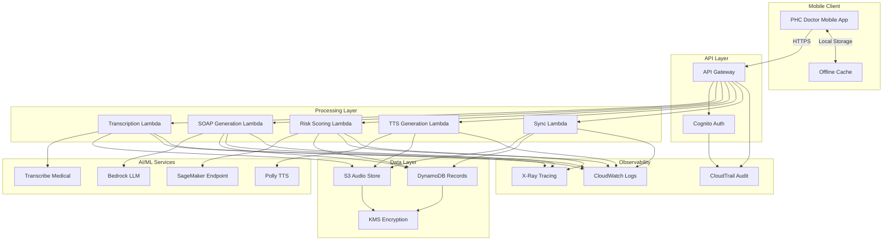

# Design Document: BharatSwasthyaAI

## Overview

BharatSwasthyaAI is a serverless, AWS-native voice-first clinical assistant that transforms doctor-patient consultations into structured digital health records. The system leverages AWS managed services to provide scalable, secure, and HIPAA-eligible healthcare data processing with support for regional Indian languages.

The architecture follows a microservices pattern using AWS Lambda functions orchestrated through API Gateway, with Amazon Bedrock providing LLM capabilities for clinical note generation, Amazon Transcribe Medical for speech recognition, and Amazon SageMaker for risk scoring inference. The system is designed for offline-first mobile operation with eventual consistency synchronization.

### Key Design Principles

1. **Serverless-First**: Minimize operational overhead using managed AWS services
2. **Offline-Capable**: Support low-connectivity PHC environments with local caching and sync
3. **Security-by-Default**: Encryption at rest and in transit, comprehensive audit logging
4. **Language-Inclusive**: Native support for English, Hindi, and Kannada with extensible language framework
5. **Scalable Architecture**: Auto-scaling components to support thousands of PHCs
6. **Cost-Optimized**: Pay-per-use pricing model suitable for resource-constrained healthcare settings

## Architecture

### High-Level Architecture



### Data Flow

1. **Consultation Recording**: Doctor records consultation audio on mobile app (offline-capable)
2. **Upload & Transcription**: Audio uploaded to S3, triggers Transcription Lambda
3. **SOAP Generation**: Transcript processed by Bedrock LLM to generate structured SOAP notes
4. **Risk Assessment**: Clinical data sent to SageMaker endpoint for risk scoring
5. **Patient Instructions**: SOAP plan section converted to regional-language TTS audio
6. **Record Storage**: All artifacts stored in DynamoDB with S3 references
7. **Sync & Retrieval**: Mobile app syncs offline data and retrieves updated records

## Components and Interfaces

### 1. Mobile Application

**Technology**: React Native with AWS Amplify SDK

**Responsibilities**:
- Audio recording and local storage
- Offline-first data caching with SQLite
- User authentication via Cognito
- API communication with retry logic
- Background sync when connectivity available

**Key Interfaces**:
```typescript
interface ConsultationRecording {
  recordingId: string;
  patientId: string;
  audioFilePath: string;
  duration: number;
  language: 'en' | 'hi' | 'kn';
  timestamp: string;
  syncStatus: 'pending' | 'syncing' | 'synced' | 'error';
}

interface PatientRecord {
  patientId: string;
  name: string;
  age: number;
  gender: string;
  consultations: Consultation[];
  riskFlags: RiskFlag[];
}
```

### 2. API Gateway

**Configuration**:
- REST API with regional endpoints
- Request validation and throttling (1000 req/sec per PHC)
- Cognito authorizer for authentication
- CORS enabled for mobile clients
- Request/response logging to CloudWatch

**Endpoints**:
```
POST   /consultations              - Upload consultation audio
GET    /consultations/{id}         - Retrieve consultation details
GET    /patients/{id}              - Retrieve patient record
POST   /patients                   - Create new patient
GET    /patients/{id}/history      - Get consultation history
POST   /sync                       - Batch sync offline data
GET    /instructions/{id}/audio    - Download TTS audio
```

### 3. Transcription Service (Lambda + Transcribe Medical)

**Lambda Configuration**:
- Runtime: Python 3.11
- Memory: 512 MB
- Timeout: 5 minutes
- Concurrency: 100

**Responsibilities**:
- Retrieve audio from S3
- Submit transcription job to Transcribe Medical
- Poll for completion or use EventBridge for async notification
- Store transcript in DynamoDB
- Handle language-specific medical vocabulary

**Implementation Approach**:
```python
def transcribe_consultation(audio_s3_uri: str, language: str) -> dict:
    """
    Transcribe medical consultation audio
    
    Args:
        audio_s3_uri: S3 URI of audio file
        language: Language code (en-US, hi-IN, kn-IN)
    
    Returns:
        Transcript with timestamps and confidence scores
    """
    # Start Transcribe Medical job
    # Configure medical vocabulary and specialty (PRIMARY_CARE)
    # Return transcript with speaker diarization
```

**Transcribe Medical Configuration**:
- Specialty: PRIMARY_CARE
- Type: CONVERSATION (doctor-patient dialogue)
- Speaker diarization: Enabled (2 speakers)
- Medical vocabulary: Custom vocabulary for Indian medical terms
- Output format: JSON with timestamps and confidence scores

### 4. SOAP Note Generator (Lambda + Bedrock)

**Lambda Configuration**:
- Runtime: Python 3.11
- Memory: 1024 MB
- Timeout: 2 minutes
- Concurrency: 50

**Responsibilities**:
- Retrieve transcript from DynamoDB
- Construct prompt for Bedrock LLM
- Parse LLM response into structured SOAP format
- Extract medications, vitals, diagnoses, ICD-10 codes
- Store structured note in DynamoDB

**Bedrock Model**: Claude 3 Sonnet (anthropic.claude-3-sonnet-20240229-v1:0)

**Prompt Engineering**:
```
System: You are a medical documentation assistant for Primary Health Centers in India. 
Extract structured clinical information from consultation transcripts.

User: Generate a SOAP note from this consultation transcript:
{transcript}

Output format:
{
  "subjective": {
    "chiefComplaint": "",
    "historyOfPresentIllness": "",
    "reviewOfSystems": []
  },
  "objective": {
    "vitals": {
      "bloodPressure": "",
      "temperature": "",
      "pulse": "",
      "weight": ""
    },
    "physicalExam": ""
  },
  "assessment": {
    "primaryDiagnosis": "",
    "icd10Code": "",
    "secondaryDiagnoses": []
  },
  "plan": {
    "medications": [],
    "investigations": [],
    "followUp": "",
    "patientEducation": ""
  }
}
```

**Implementation Approach**:
```python
def generate_soap_note(transcript: str, patient_context: dict) -> dict:
    """
    Generate structured SOAP note from transcript
    
    Args:
        transcript: Consultation transcript text
        patient_context: Previous consultations and medical history
    
    Returns:
        Structured SOAP note with extracted clinical entities
    """
    # Construct prompt with transcript and patient context
    # Call Bedrock with Claude 3 Sonnet
    # Parse JSON response
    # Validate required fields
    # Return structured note
```

### 5. Risk Scoring Engine (Lambda + SageMaker)

**Lambda Configuration**:
- Runtime: Python 3.11
- Memory: 512 MB
- Timeout: 30 seconds
- Concurrency: 50

**SageMaker Endpoint**:
- Model: XGBoost or LightGBM trained on synthetic Indian PHC data
- Instance: ml.t2.medium (cost-optimized for inference)
- Auto-scaling: 1-10 instances based on invocations

**Risk Models**:
1. **Diabetes Risk**: Features include age, BMI, family history, fasting glucose, HbA1c
2. **Hypertension Risk**: Features include age, BP readings, sodium intake, stress indicators
3. **Pregnancy Complications**: Features include gestational age, BP, proteinuria, previous complications

**Implementation Approach**:
```python
def compute_risk_scores(clinical_data: dict) -> dict:
    """
    Compute risk scores for common conditions
    
    Args:
        clinical_data: Structured clinical data from SOAP note
    
    Returns:
        Risk scores and flags for diabetes, hypertension, pregnancy
    """
    # Extract features from clinical data
    # Normalize and encode features
    # Call SageMaker endpoint for each risk model
    # Apply threshold logic for high-risk flags
    # Return scores with explainability factors
```

**Risk Thresholds**:
- Low Risk: Score < 0.3
- Moderate Risk: 0.3 ≤ Score < 0.7
- High Risk: Score ≥ 0.7

### 6. Patient Instruction Generator (Lambda + Polly)

**Lambda Configuration**:
- Runtime: Python 3.11
- Memory: 512 MB
- Timeout: 1 minute
- Concurrency: 50

**Amazon Polly Configuration**:
- Voices: 
  - English: Aditi (Indian English)
  - Hindi: Aditi (bilingual)
  - Kannada: Custom neural voice (if available) or Aditi with SSML
- Output format: MP3, 24 kbps (optimized for mobile)
- Speech rate: Slow (0.85x) for better comprehension

**Responsibilities**:
- Extract plan section from SOAP note
- Generate patient-friendly instructions in regional language
- Convert text to speech using Polly
- Store audio in S3
- Return S3 URI for mobile app playback

**Implementation Approach**:
```python
def generate_patient_instructions(soap_plan: dict, language: str) -> str:
    """
    Generate regional-language patient instructions
    
    Args:
        soap_plan: Plan section from SOAP note
        language: Target language (en, hi, kn)
    
    Returns:
        S3 URI of generated TTS audio file
    """
    # Translate plan to patient-friendly language
    # Use Bedrock for simplification and translation
    # Generate SSML for better pronunciation
    # Call Polly to synthesize speech
    # Upload audio to S3
    # Return S3 URI
```

### 7. Sync Service (Lambda)

**Lambda Configuration**:
- Runtime: Python 3.11
- Memory: 1024 MB
- Timeout: 5 minutes
- Concurrency: 100

**Responsibilities**:
- Handle batch uploads from offline mobile clients
- Implement conflict resolution for concurrent edits
- Support resumable uploads for large audio files
- Maintain sync state in DynamoDB
- Trigger processing pipeline for uploaded consultations

**Conflict Resolution Strategy**:
- Last-Write-Wins for patient demographics
- Preserve-Both for consultations (never overwrite)
- Manual-Review for conflicting clinical notes on same consultation

### 8. Data Layer

#### DynamoDB Schema

**Patients Table**:
```
Partition Key: patientId (String)
Attributes:
  - name (String)
  - age (Number)
  - gender (String)
  - phoneNumber (String, encrypted)
  - address (String, encrypted)
  - createdAt (String, ISO timestamp)
  - updatedAt (String, ISO timestamp)
  - phcId (String)
  
GSI: phcId-createdAt-index (for PHC-level queries)
```

**Consultations Table**:
```
Partition Key: consultationId (String)
Sort Key: timestamp (String, ISO timestamp)
Attributes:
  - patientId (String)
  - doctorId (String)
  - audioS3Uri (String)
  - transcriptS3Uri (String)
  - language (String)
  - duration (Number)
  - status (String: pending|transcribed|processed|complete)
  
GSI: patientId-timestamp-index (for patient history queries)
```

**ClinicalNotes Table**:
```
Partition Key: consultationId (String)
Attributes:
  - soapNote (Map)
    - subjective (Map)
    - objective (Map)
    - assessment (Map)
    - plan (Map)
  - extractedEntities (Map)
    - medications (List)
    - vitals (Map)
    - diagnoses (List)
    - icd10Codes (List)
  - createdAt (String)
  - version (Number)
```

**RiskAssessments Table**:
```
Partition Key: patientId (String)
Sort Key: assessmentDate (String)
Attributes:
  - consultationId (String)
  - diabetesRisk (Number)
  - hypertensionRisk (Number)
  - pregnancyRisk (Number)
  - riskFlags (List)
  - explainabilityFactors (Map)
```

**PatientInstructions Table**:
```
Partition Key: consultationId (String)
Attributes:
  - language (String)
  - textContent (String)
  - audioS3Uri (String)
  - createdAt (String)
```

#### S3 Bucket Structure

```
bharat-swasthya-audio-{region}-{account-id}/
├── consultations/
│   ├── {phcId}/
│   │   ├── {year}/
│   │   │   ├── {month}/
│   │   │   │   ├── {consultationId}.mp3
│   │   │   │   └── {consultationId}-transcript.json
├── instructions/
│   ├── {consultationId}/
│   │   ├── en.mp3
│   │   ├── hi.mp3
│   │   └── kn.mp3
└── demo/
    ├── demo-en.mp3
    ├── demo-hi.mp3
    └── demo-kn.mp3
```

**S3 Configuration**:
- Encryption: SSE-KMS with customer-managed key
- Versioning: Enabled for audit trail
- Lifecycle policy: Archive to Glacier after 1 year, delete after 7 years
- Access logging: Enabled to separate audit bucket
- Block public access: Enabled

### 9. Authentication & Authorization (Cognito)

**User Pool Configuration**:
- MFA: Optional (SMS-based for administrators)
- Password policy: Minimum 12 characters, complexity requirements
- Account recovery: Email and SMS
- Custom attributes: phcId, role, district

**User Groups**:
1. **Doctors**: Full access to consultations, clinical notes, patient records
2. **ASHA_Workers**: Read-only access to patient instructions and basic demographics
3. **Administrators**: Access to aggregate reports, audit logs, system configuration

**IAM Roles**:
- Lambda execution roles with least-privilege permissions
- Mobile app role with scoped S3 and DynamoDB access
- SageMaker execution role for model inference

### 10. Monitoring & Observability

**CloudWatch Metrics**:
- Transcription success rate and latency
- SOAP generation latency and error rate
- Risk scoring latency
- API Gateway request count and latency (p50, p95, p99)
- Lambda invocation count, duration, errors, throttles
- DynamoDB read/write capacity utilization

**CloudWatch Alarms**:
- Transcription error rate > 5%
- API Gateway 5xx errors > 1%
- Lambda concurrent executions > 80% of limit
- DynamoDB throttled requests > 0
- S3 bucket size > 80% of quota

**CloudWatch Dashboards**:
- Real-time system health overview
- Per-PHC consultation volume and processing times
- Cost tracking by service
- Error rate trends

**X-Ray Tracing**:
- End-to-end request tracing from API Gateway through all Lambda functions
- Service map visualization
- Latency analysis and bottleneck identification

**CloudTrail Audit Logging**:
- All API calls to AWS services
- Data access events for S3 and DynamoDB
- Authentication events from Cognito
- Administrative actions
- Retention: 7 years in S3 with Glacier archival

## Data Models

### Core Domain Models

```typescript
// Patient
interface Patient {
  patientId: string;
  name: string;
  age: number;
  gender: 'M' | 'F' | 'O';
  phoneNumber: string;  // Encrypted
  address: string;       // Encrypted
  phcId: string;
  createdAt: string;
  updatedAt: string;
}

// Consultation
interface Consultation {
  consultationId: string;
  patientId: string;
  doctorId: string;
  timestamp: string;
  language: 'en' | 'hi' | 'kn';
  audioS3Uri: string;
  transcriptS3Uri?: string;
  duration: number;
  status: 'pending' | 'transcribed' | 'processed' | 'complete' | 'error';
}

// Transcript
interface Transcript {
  consultationId: string;
  text: string;
  segments: TranscriptSegment[];
  language: string;
  confidence: number;
}

interface TranscriptSegment {
  speaker: 'doctor' | 'patient';
  text: string;
  startTime: number;
  endTime: number;
  confidence: number;
}

// SOAP Note
interface SOAPNote {
  consultationId: string;
  subjective: {
    chiefComplaint: string;
    historyOfPresentIllness: string;
    reviewOfSystems: string[];
  };
  objective: {
    vitals: Vitals;
    physicalExam: string;
  };
  assessment: {
    primaryDiagnosis: string;
    icd10Code: string;
    secondaryDiagnoses: Diagnosis[];
  };
  plan: {
    medications: Medication[];
    investigations: string[];
    followUp: string;
    patientEducation: string;
  };
  createdAt: string;
  version: number;
}

interface Vitals {
  bloodPressure?: string;  // e.g., "120/80"
  temperature?: number;     // Celsius
  pulse?: number;           // bpm
  weight?: number;          // kg
  height?: number;          // cm
  bmi?: number;
}

interface Medication {
  name: string;
  dosage: string;
  frequency: string;
  duration: string;
  route: string;
}

interface Diagnosis {
  condition: string;
  icd10Code: string;
  severity?: 'mild' | 'moderate' | 'severe';
}

// Risk Assessment
interface RiskAssessment {
  patientId: string;
  consultationId: string;
  assessmentDate: string;
  diabetesRisk: number;      // 0-1 score
  hypertensionRisk: number;  // 0-1 score
  pregnancyRisk: number;     // 0-1 score
  riskFlags: RiskFlag[];
  explainabilityFactors: Map<string, string[]>;
}

interface RiskFlag {
  condition: 'diabetes' | 'hypertension' | 'pregnancy';
  severity: 'low' | 'moderate' | 'high';
  score: number;
  factors: string[];
}

// Patient Instructions
interface PatientInstructions {
  consultationId: string;
  language: 'en' | 'hi' | 'kn';
  textContent: string;
  audioS3Uri: string;
  createdAt: string;
}

// Sync State
interface SyncState {
  deviceId: string;
  lastSyncTimestamp: string;
  pendingUploads: string[];  // consultationIds
  conflictingRecords: string[];
}
```

### API Request/Response Models

```typescript
// Upload Consultation Request
interface UploadConsultationRequest {
  patientId: string;
  language: 'en' | 'hi' | 'kn';
  audioBase64?: string;  // For small files
  audioS3Key?: string;   // For pre-uploaded large files
  duration: number;
  recordedAt: string;
}

interface UploadConsultationResponse {
  consultationId: string;
  status: string;
  estimatedProcessingTime: number;
}

// Get Patient History Request
interface GetPatientHistoryRequest {
  patientId: string;
  startDate?: string;
  endDate?: string;
  limit?: number;
}

interface GetPatientHistoryResponse {
  patient: Patient;
  consultations: ConsultationSummary[];
  riskAssessments: RiskAssessment[];
}

interface ConsultationSummary {
  consultationId: string;
  timestamp: string;
  primaryDiagnosis: string;
  medications: string[];
  riskFlags: string[];
}

// Batch Sync Request
interface BatchSyncRequest {
  deviceId: string;
  lastSyncTimestamp: string;
  consultations: UploadConsultationRequest[];
}

interface BatchSyncResponse {
  syncedConsultations: string[];
  failedConsultations: SyncError[];
  conflicts: ConflictRecord[];
  newRecords: ConsultationSummary[];
}
```


## Correctness Properties

*A property is a characteristic or behavior that should hold true across all valid executions of a system—essentially, a formal statement about what the system should do. Properties serve as the bridge between human-readable specifications and machine-verifiable correctness guarantees.*

### Property 1: Transcription Language Support

*For any* valid consultation audio file in English, Hindi, or Kannada, when submitted to the Transcription_Service, the system should return a transcript with timestamps for each segment.

**Validates: Requirements 1.1**

### Property 2: Transcript Persistence Round-Trip

*For any* completed transcription, storing the transcript in the Record_Store and then retrieving it by consultationId should return an equivalent transcript with all metadata preserved.

**Validates: Requirements 1.3**

### Property 3: Low-Confidence Segment Flagging

*For any* audio segment with confidence score below the threshold (e.g., 0.7), the Transcription_Service should flag that segment in the transcript output.

**Validates: Requirements 1.4**

### Property 4: SOAP Note Structure Completeness

*For any* valid consultation transcript, the generated SOAP note should contain all four required sections: Subjective, Objective, Assessment, and Plan, with each section containing structured data.

**Validates: Requirements 2.1**

### Property 5: Clinical Entity Extraction Completeness

*For any* transcript containing clinical entities (medications, vitals, diagnoses), the Clinical_Note_Generator should extract all mentioned entities with their associated attributes (e.g., medication dosage, vital sign values, ICD-10 codes).

**Validates: Requirements 2.2, 2.3, 2.4, 2.5**

### Property 6: SOAP Note Persistence and Linking

*For any* generated SOAP note, storing it in the Record_Store should link it to the correct patient record, and retrieving the patient record should include the SOAP note in the consultation history.

**Validates: Requirements 2.6**

### Property 7: Risk Score Computation Completeness

*For any* patient with valid clinical data, the Risk_Scoring_Engine should compute all three risk scores (diabetes, hypertension, pregnancy) and include explainability factors for each score.

**Validates: Requirements 3.1, 3.5**

### Property 8: Risk Threshold Flagging

*For any* risk score that exceeds the high-risk threshold (≥ 0.7), the Risk_Scoring_Engine should set a high-risk flag for that condition.

**Validates: Requirements 3.2**

### Property 9: Risk Flag Consistency

*For any* generated risk flag, it should appear in both the clinical note and the patient record with consistent severity and score values.

**Validates: Requirements 3.3**

### Property 10: Regional Language Instruction Generation

*For any* completed consultation with a specified language preference (en, hi, or kn), the Patient_Instruction_Generator should create discharge instructions in that language.

**Validates: Requirements 4.1**

### Property 11: Patient Instruction Completeness

*For any* generated patient instructions, the content should include all required sections: medication schedule, dietary advice, follow-up appointments, and warning signs.

**Validates: Requirements 4.2**

### Property 12: Text-to-Speech Round-Trip

*For any* generated patient instruction text, converting it to speech audio and storing it should produce a retrievable audio file in the specified language with the Audio_Store URI.

**Validates: Requirements 4.3, 4.4**

### Property 13: Offline Data Encryption

*For any* consultation data cached locally while offline, the data should be encrypted using the device's encryption mechanism before storage.

**Validates: Requirements 5.1**

### Property 14: Sync Upload Completeness

*For any* set of cached consultations, when network connectivity is restored, all cached consultations should be uploaded to the Audio_Store and marked as synced.

**Validates: Requirements 5.2**

### Property 15: Resumable Upload Recovery

*For any* interrupted upload, when the upload is resumed, it should continue from the last successfully uploaded chunk rather than restarting from the beginning.

**Validates: Requirements 5.3**

### Property 16: Conflict Preservation

*For any* sync operation that detects conflicting edits, both versions should be preserved in the Record_Store and flagged for manual resolution.

**Validates: Requirements 5.4**

### Property 17: Offline Record Access

*For any* patient record that was previously synced, when the device is offline, the record should be accessible from local cache with all consultation history.

**Validates: Requirements 5.5**

### Property 18: Patient History Retrieval Completeness

*For any* patient with historical data, querying the patient record should return all associated consultations, SOAP notes, and risk assessments.

**Validates: Requirements 6.1**

### Property 19: Consultation Linking

*For any* new consultation created for an existing patient, the consultation should be linked to that patient's record; for a new patient, a new patient record should be created and linked.

**Validates: Requirements 6.2**

### Property 20: Chronological Ordering

*For any* patient history query, the returned consultations should be ordered by timestamp in descending order (most recent first).

**Validates: Requirements 6.4**

### Property 21: Version History Preservation

*For any* patient record update, the system should create a new version while preserving all previous versions with their timestamps.

**Validates: Requirements 6.5**

### Property 22: Authentication Token Issuance

*For any* valid user credentials, the Authentication_Service should verify them and issue a session token with appropriate expiration time.

**Validates: Requirements 7.1**

### Property 23: Role-Based Permission Enforcement

*For any* authenticated user, the system should enforce permissions based on their assigned role (Doctor, ASHA Worker, Administrator), allowing or denying access to resources accordingly.

**Validates: Requirements 7.2**

### Property 24: Data Encryption at Rest

*For any* data stored in the Record_Store or Audio_Store, it should be encrypted using AWS KMS with the configured customer-managed key.

**Validates: Requirements 8.1**

### Property 25: Data Encryption in Transit

*For any* data transmitted between system components, the communication should use TLS 1.2 or higher encryption.

**Validates: Requirements 8.2**

### Property 26: Audit Log Completeness

*For any* action performed on patient data, an audit log entry should be created in CloudWatch Logs and CloudTrail containing timestamp, user identity, action type, and affected resource identifiers.

**Validates: Requirements 8.3, 8.4**

### Property 27: Metrics Emission

*For any* system component execution (Lambda, API Gateway), metrics for latency, error count, and invocation count should be emitted to CloudWatch.

**Validates: Requirements 10.1**

### Property 28: Error Logging Detail

*For any* error that occurs during system operation, a log entry should be created containing the error message, stack trace, request context, and timestamp.

**Validates: Requirements 10.2**

### Property 29: Alarm Triggering

*For any* metric that exceeds its configured threshold, a CloudWatch alarm should transition to ALARM state and trigger configured notifications.

**Validates: Requirements 10.3**

### Property 30: Distributed Tracing

*For any* API request, an X-Ray trace should be generated showing the complete request flow through all invoked components with timing information.

**Validates: Requirements 10.5**

## Error Handling

### Transcription Errors

**Scenario**: Audio file is corrupted or in unsupported format
- **Handling**: Return HTTP 400 with error code `INVALID_AUDIO_FORMAT`
- **Logging**: Log error with audio metadata and file size
- **User Feedback**: Display message: "Audio file format not supported. Please use MP3, WAV, or M4A."

**Scenario**: Transcribe Medical service is unavailable
- **Handling**: Retry with exponential backoff (3 attempts), then return HTTP 503
- **Logging**: Log service unavailability and retry attempts
- **User Feedback**: Display message: "Transcription service temporarily unavailable. Your audio has been saved and will be processed automatically."

**Scenario**: Audio contains no speech or is silent
- **Handling**: Return transcript with empty segments and confidence score of 0
- **Logging**: Log warning with audio duration and file size
- **User Feedback**: Display message: "No speech detected in audio. Please check recording quality."

### SOAP Generation Errors

**Scenario**: Transcript is too short or lacks clinical content
- **Handling**: Generate partial SOAP note with available information, mark missing sections as "Not documented"
- **Logging**: Log warning with transcript length and extracted entities count
- **User Feedback**: Display message: "Limited clinical information detected. Please review and complete the note manually."

**Scenario**: Bedrock LLM returns malformed JSON
- **Handling**: Retry with clarified prompt (1 attempt), then fallback to structured template
- **Logging**: Log malformed response and retry outcome
- **User Feedback**: Display message: "Automated note generation incomplete. Template provided for manual completion."

**Scenario**: ICD-10 code mapping fails for diagnosis
- **Handling**: Leave ICD-10 code field empty, flag for manual coding
- **Logging**: Log unmapped diagnosis text
- **User Feedback**: Display message: "Diagnosis requires manual ICD-10 coding."

### Risk Scoring Errors

**Scenario**: SageMaker endpoint is unavailable
- **Handling**: Skip risk scoring, mark assessment as "Pending", retry asynchronously
- **Logging**: Log endpoint unavailability and queue retry
- **User Feedback**: Display message: "Risk assessment will be available shortly."

**Scenario**: Insufficient data for risk scoring
- **Handling**: Return risk scores as null with explanation of missing data
- **Logging**: Log missing features required for scoring
- **User Feedback**: Display message: "Insufficient data for risk assessment. Required: vitals, diagnosis history."

**Scenario**: Risk score computation returns invalid value (< 0 or > 1)
- **Handling**: Clamp score to valid range [0, 1], log anomaly
- **Logging**: Log invalid score value and clamped result
- **User Feedback**: Display clamped score with warning indicator

### TTS Generation Errors

**Scenario**: Polly service is unavailable
- **Handling**: Store text instructions without audio, retry TTS asynchronously
- **Logging**: Log service unavailability and retry queue
- **User Feedback**: Display message: "Audio instructions will be available shortly. Text instructions are ready."

**Scenario**: Text contains unsupported characters for target language
- **Handling**: Transliterate or remove unsupported characters, generate audio with cleaned text
- **Logging**: Log character cleaning operations
- **User Feedback**: Display message: "Some characters were adjusted for audio generation."

### Sync Errors

**Scenario**: Network connection lost during upload
- **Handling**: Pause upload, save progress, resume when connectivity restored
- **Logging**: Log interrupted upload with bytes transferred
- **User Feedback**: Display message: "Upload paused. Will resume automatically when online."

**Scenario**: Conflicting edits detected during sync
- **Handling**: Preserve both versions, create conflict record, notify user
- **Logging**: Log conflict details with both version timestamps
- **User Feedback**: Display message: "Conflicting changes detected. Please review and resolve."

**Scenario**: Server rejects upload due to validation error
- **Handling**: Mark upload as failed, store error details, allow manual retry
- **Logging**: Log validation error details
- **User Feedback**: Display message: "Upload failed: [specific validation error]. Please review and retry."

### Authentication Errors

**Scenario**: Invalid credentials provided
- **Handling**: Return HTTP 401, increment failed login counter
- **Logging**: Log failed login attempt with username (not password)
- **User Feedback**: Display message: "Invalid username or password."

**Scenario**: Session token expired
- **Handling**: Return HTTP 401, clear local session, redirect to login
- **Logging**: Log session expiration
- **User Feedback**: Display message: "Your session has expired. Please log in again."

**Scenario**: User lacks permission for requested operation
- **Handling**: Return HTTP 403 with specific permission required
- **Logging**: Log authorization failure with user role and attempted action
- **User Feedback**: Display message: "You don't have permission to perform this action."

### Data Storage Errors

**Scenario**: DynamoDB write fails due to capacity exceeded
- **Handling**: Retry with exponential backoff, enable auto-scaling if not already enabled
- **Logging**: Log capacity exception and retry attempts
- **User Feedback**: Display message: "System is experiencing high load. Retrying..."

**Scenario**: S3 upload fails due to insufficient permissions
- **Handling**: Log error, alert administrators, return HTTP 500
- **Logging**: Log permission error with IAM role and bucket details
- **User Feedback**: Display message: "Upload failed due to system configuration. Support has been notified."

**Scenario**: Data encryption fails
- **Handling**: Abort operation, do not store unencrypted data, return HTTP 500
- **Logging**: Log encryption failure with KMS key ID
- **User Feedback**: Display message: "Security error occurred. Data was not saved. Please try again."

## Testing Strategy

### Overview

BharatSwasthyaAI employs a comprehensive testing strategy combining unit tests for specific scenarios and property-based tests for universal correctness guarantees. This dual approach ensures both concrete functionality and general system behavior are validated.

### Unit Testing

Unit tests focus on specific examples, edge cases, and integration points:

**Transcription Service**:
- Test with sample audio files in each supported language (English, Hindi, Kannada)
- Test with corrupted audio files to verify error handling
- Test with silent audio to verify empty transcript handling
- Test speaker diarization with multi-speaker audio
- Test timestamp accuracy with known audio segments

**SOAP Note Generator**:
- Test with sample transcripts containing complete clinical information
- Test with minimal transcripts to verify partial note generation
- Test ICD-10 code mapping for common diagnoses
- Test medication extraction with various formats (e.g., "Metformin 500mg BD", "500 mg metformin twice daily")
- Test vital sign extraction with different units and formats

**Risk Scoring Engine**:
- Test with patient data at risk threshold boundaries (0.69, 0.70, 0.71)
- Test with missing features to verify graceful degradation
- Test explainability factor generation for high-risk patients
- Test with edge cases (e.g., age 0, age 120, negative vitals)

**Patient Instruction Generator**:
- Test TTS generation for each supported language
- Test instruction completeness with various SOAP plan sections
- Test with special characters and medical terminology
- Test audio file storage and retrieval

**Sync Service**:
- Test conflict detection with concurrent edits
- Test resumable upload with simulated interruptions
- Test batch sync with multiple consultations
- Test offline cache encryption and decryption

**Authentication & Authorization**:
- Test login flow with valid and invalid credentials
- Test token expiration and refresh
- Test role-based access for each user type (Doctor, ASHA, Admin)
- Test MFA flow for administrative functions

### Property-Based Testing

Property-based tests validate universal correctness properties across randomly generated inputs. Each test should run a minimum of 100 iterations to ensure comprehensive coverage.

**Testing Framework**: 
- Python: Use `hypothesis` library
- TypeScript: Use `fast-check` library

**Property Test Configuration**:
```python
# Example configuration for hypothesis
from hypothesis import given, settings
import hypothesis.strategies as st

@settings(max_examples=100, deadline=None)
@given(
    audio_file=st.audio_files(),
    language=st.sampled_from(['en', 'hi', 'kn'])
)
def test_transcription_language_support(audio_file, language):
    """
    Feature: bharat-swasthya-ai, Property 1: Transcription Language Support
    For any valid consultation audio file in English, Hindi, or Kannada,
    when submitted to the Transcription_Service, the system should return
    a transcript with timestamps for each segment.
    """
    # Test implementation
```

**Property Test Tagging**:
Each property test must include a comment referencing its design document property:
```
Feature: bharat-swasthya-ai, Property {number}: {property title}
```

**Key Property Tests**:

1. **Transcription Properties** (Properties 1-3):
   - Generate random audio files in supported languages
   - Verify transcript structure and timestamp presence
   - Test round-trip storage and retrieval
   - Test confidence score flagging with varying quality audio

2. **SOAP Generation Properties** (Properties 4-6):
   - Generate random transcripts with clinical content
   - Verify SOAP structure completeness
   - Verify entity extraction for all entity types
   - Test persistence and patient linking

3. **Risk Scoring Properties** (Properties 7-9):
   - Generate random patient clinical data
   - Verify all risk scores are computed
   - Verify threshold-based flagging
   - Verify consistency across clinical note and patient record

4. **Regional Language Properties** (Properties 10-12):
   - Generate random SOAP plans
   - Verify instruction generation in all languages
   - Verify instruction completeness
   - Test TTS generation and storage

5. **Offline Sync Properties** (Properties 13-17):
   - Generate random consultation data
   - Verify offline encryption
   - Verify sync completeness after connectivity restoration
   - Test resumable uploads with simulated interruptions
   - Test conflict detection and preservation

6. **Patient Record Properties** (Properties 18-21):
   - Generate random patient histories
   - Verify retrieval completeness
   - Verify consultation linking logic
   - Verify chronological ordering
   - Test version history preservation

7. **Security Properties** (Properties 22-26):
   - Generate random user credentials and roles
   - Verify authentication token issuance
   - Verify role-based permission enforcement
   - Verify encryption at rest and in transit
   - Verify audit log completeness

8. **Observability Properties** (Properties 27-30):
   - Generate random system operations
   - Verify metrics emission
   - Verify error logging detail
   - Verify alarm triggering
   - Verify distributed tracing

### Integration Testing

Integration tests validate end-to-end workflows:

**Complete Consultation Workflow**:
1. Upload audio → Transcribe → Generate SOAP → Compute risk → Generate instructions
2. Verify all artifacts are created and linked correctly
3. Verify audit logs are generated at each step
4. Verify metrics are emitted for each component

**Offline-to-Online Workflow**:
1. Record consultation offline → Cache locally → Restore connectivity → Sync
2. Verify data integrity after sync
3. Verify encryption throughout the process

**Multi-User Workflow**:
1. Doctor creates consultation → ASHA worker views instructions → Admin views audit logs
2. Verify role-based access at each step
3. Verify data consistency across user sessions

### Demo Testing

**Demo Scenario Tests**:
- Test with three pre-loaded demo audio files (English, Hindi, Kannada)
- Verify complete workflow execution within 30 seconds per file
- Verify all output artifacts are generated (transcript, SOAP, risk flags, TTS audio)
- Verify demo results are displayable in presentation format

### Performance Testing

**Load Testing**:
- Simulate 100 concurrent transcription requests
- Measure API Gateway and Lambda latency (p50, p95, p99)
- Verify auto-scaling behavior under load
- Measure DynamoDB read/write latency

**Stress Testing**:
- Test with audio files of varying sizes (1 minute to 30 minutes)
- Test with large patient histories (100+ consultations)
- Test sync with large batches (50+ cached consultations)

**Endurance Testing**:
- Run continuous load for 24 hours
- Monitor for memory leaks or performance degradation
- Verify CloudWatch metrics remain within acceptable ranges

### Security Testing

**Penetration Testing**:
- Test authentication bypass attempts
- Test authorization escalation attempts
- Test SQL injection and XSS (though using DynamoDB and API Gateway validation)
- Test encryption verification for data at rest and in transit

**Compliance Testing**:
- Verify HIPAA-eligible AWS services are used
- Verify audit logging meets compliance requirements
- Verify data retention and deletion policies
- Verify encryption key management

### Test Environment

**Development Environment**:
- Local DynamoDB and S3 (LocalStack)
- Mocked AWS services for rapid iteration
- Unit and property tests run on every commit

**Staging Environment**:
- Full AWS environment with separate account
- Integration and end-to-end tests
- Performance testing with production-like data volumes
- Demo testing with actual demo audio files

**Production Environment**:
- Synthetic monitoring with CloudWatch Synthetics
- Real-user monitoring with X-Ray
- Automated rollback on error rate threshold breach

### Continuous Integration

**CI Pipeline**:
1. Run unit tests (< 5 minutes)
2. Run property tests (< 15 minutes)
3. Run integration tests (< 10 minutes)
4. Deploy to staging on main branch
5. Run smoke tests in staging
6. Manual approval for production deployment

**Test Coverage Goals**:
- Unit test coverage: > 80% for business logic
- Property test coverage: 100% of correctness properties
- Integration test coverage: All critical user workflows
- End-to-end test coverage: All demo scenarios

### Test Data Management

**Synthetic Data Generation**:
- Generate synthetic patient data complying with Indian demographics
- Generate synthetic audio using TTS for automated testing
- Generate synthetic transcripts with clinical content
- Anonymize any real data used for testing

**Demo Data**:
- Three anonymized audio files (English, Hindi, Kannada)
- Pre-generated expected outputs for demo validation
- Version-controlled demo data for reproducibility

